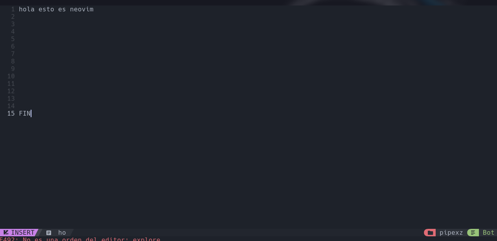

# Bienvenido a mi setup


## Este es mi configuracion basado en uno que tome de otro lugar y lo modifque ami gusto 

* Incluye color diferente y bordes en el area
* le añade el icono de bateria  configurado listo que sirve para su estado  (en caso de que este de forma nativa en un notebook)
* otros recurso 


Para instalar KaliBspwm, sigue estos pasos:

1. Clona el repositorio(gracias ZLCube):

    ```bash
    git clone https://github.com/ZLCube/KaliBspwm.git 
    cd KaliBspwm
    chmod +x install.sh
   ./install.sh
 
     
    ```

2. una vez configurado movemos los archivos necesarios:

    ```bash
    cd mi_setup/
    mv bin bspwm polybar sxhkd ~/.config


  - recursos otros
     ```bash
    apt install apt install flameshot -y
 para instalar nvim 

```bash
    primero nos bajamos este repo
    git clone https://github.com/NvChad/NvChad.git ~/.config/nvim/ --depth 1
     NOTA: Se debe hacer lo mismo para tenerlo como usuario no privilegiado

```bash
    primero nos bajamos este repo
    git clone https://github.com/NvChad/NvChad.git ~/.config/nvim/ --depth 1
     NOTA: Se debe hacer lo mismo para tenerlo como usuario no privilegiado

